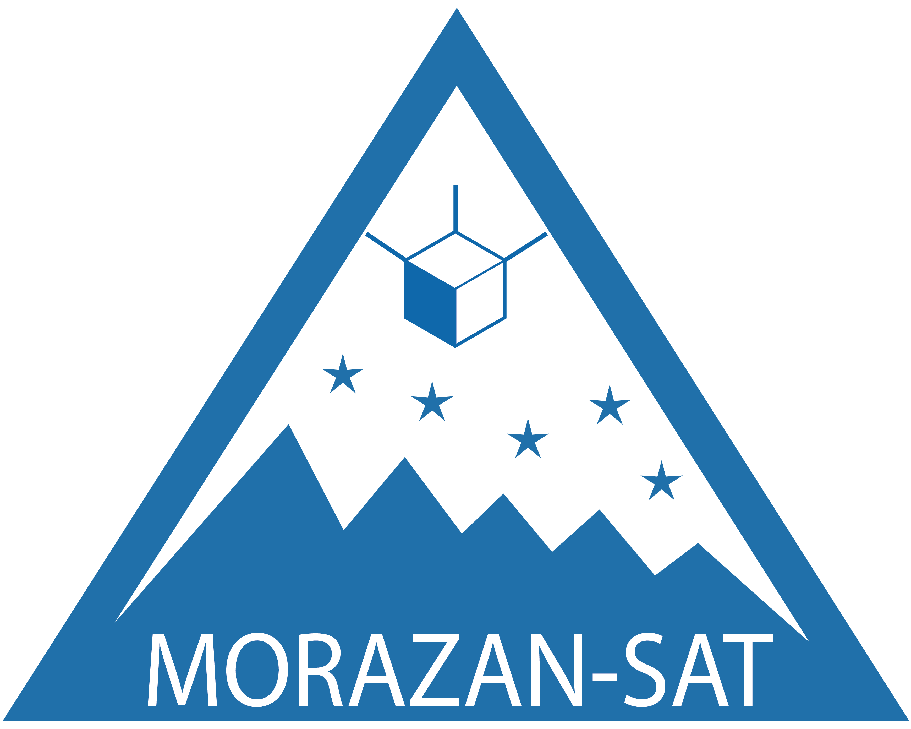

<!--
*** Thanks for checking out the Best-README-Template. If you have a suggestion
*** that would make this better, please fork the repo and create a pull request
*** or simply open an issue with the tag "enhancement".
*** Thanks again! Now go create something AMAZING! :D
-->


<!-- PROJECT SHIELDS -->
<!--
*** I'm using markdown "reference style" links for readability.
*** Reference links are enclosed in brackets [ ] instead of parentheses ( ).
*** See the bottom of this document for the declaration of the reference variables
*** for contributors-url, forks-url, etc. This is an optional, concise syntax you may use.
*** https://www.markdownguide.org/basic-syntax/#reference-style-links
-->
[![Contributors][contributors-shield]][contributors-url]
[![Forks][forks-shield]][forks-url]
[![Stargazers][stars-shield]][stars-url]
[![Issues][issues-shield]][issues-url]
[![MIT License][license-shield]][license-url]


<!-- PROJECT LOGO -->
<br />
<p align="center">
  <a href="https://github.com/GaryCastillo8/Morazan-Tracking-Software">
    
  </a>

  <h3 align="center">MORAZAN TRACKING SOFTWARE</h3>

  <p align="center">
    An awesome README template to jumpstart your projects!
    <br />
    <a href="https://github.com/GaryCastillo8/Morazan-Tracking-Software"><strong>Explore the docs »</strong></a>
    <br />
    <br />
    <a href="https://github.com/GaryCastillo8/Morazan-Tracking-Software">View Demo</a>
    ·
    <a href="https://github.com/GaryCastillo8/Morazan-Tracking-Softwaree/issues">Report Bug</a>
    ·
    <a href="https://github.com/GaryCastillo8/Morazan-Tracking-Software/issues">Request Feature</a>
  </p>
</p>


<!-- TABLE OF CONTENTS -->
<details>
  <summary>Table of Contents</summary>
  <ol>
    <li>
      <a href="#about-the-project">About The Project</a>
      <ul>
        <li><a href="#built-with">Built With</a></li>
      </ul>
    </li>
    <li>
      <a href="#getting-started">Getting Started</a>
      <ul>
        <li><a href="#prerequisites">Prerequisites</a></li>
        <li><a href="#installation">Installation</a></li>
      </ul>
    </li>
    <li><a href="#usage">Usage</a></li>
    <li><a href="#roadmap">Roadmap</a></li>
    <li><a href="#contributing">Contributing</a></li>
    <li><a href="#license">License</a></li>
    <li><a href="#contact">Contact</a></li>
    <li><a href="#acknowledgements">Acknowledgements</a></li>
  </ol>
</details>


<!-- ABOUT THE PROJECT -->
## About The Project


MTS is a tracking and orbit propagator software. Shows the world map with the position of the CubeSat and Cabañas ground station, located in Tegucigalpa, Honduras. It also display the CubeSat trajectory and coverage in real time.

The main purposes:
* Show the real-time location of the satellite
* Find its orbital parameters
* Show the visibility window
* To know the events above Central America and Cabañas ground station.

Of course, no one template will serve all projects since your needs may be different. So I'll be adding more in the near future. You may also suggest changes by forking this repo and creating a pull request or opening an issue. Thanks to all the people have have contributed to expanding this template!

A list of commonly used resources that I find helpful are listed in the acknowledgements.

### Built With

This section should list any major frameworks that you built your project using. Leave any add-ons/plugins for the acknowledgements section. Here are a few examples.
* [Python](https://www.python.org)


<!-- GETTING STARTED -->
## Getting Started

This is an example of how you may give instructions on setting up your project locally.
To get a local copy up and running follow these simple example steps.

### Prerequisites

This is an example of how to list things you need to use the software and how to install them.
* npm
  ```sh
  npm install npm@latest -g
  ```

### Installation

1. Get a free API Key at [https://example.com](https://example.com)
2. Clone the repo
   ```sh
   git clone https://github.com/GaryCastillo8/Morazan-Tracking-Software.git
   ```
3. Install NPM packages
   ```sh
   npm install
   ```
4. Enter your API in `config.js`
   ```JS
   const API_KEY = 'ENTER YOUR API';
   ```


<!-- USAGE EXAMPLES -->
## Usage

Use this space to show useful examples of how a project can be used. Additional screenshots, code examples and demos work well in this space. You may also link to more resources.

_For more examples, please refer to the [Documentation](https://example.com)_


<!-- ROADMAP -->
## Roadmap

See the [open issues](https://github.com/GaryCastillo8/Morazan-Tracking-Software/issues) for a list of proposed features (and known issues).


<!-- CONTRIBUTING -->
## Contributing

Contributions are what make the open source community such an amazing place to be learn, inspire, and create. Any contributions you make are **greatly appreciated**.

1. Fork the Project
2. Create your Feature Branch (`git checkout -b feature/AmazingFeature`)
3. Commit your Changes (`git commit -m 'Add some AmazingFeature'`)
4. Push to the Branch (`git push origin feature/AmazingFeature`)
5. Open a Pull Request


<!-- LICENSE -->
## License

Distributed under the GPL-3.0 License. See `LICENSE` for more information.


<!-- CONTACT -->
## Contact

Your Name - [@your_twitter](https://twitter.com/your_username) - email@example.com

Project Link: [https://github.com/GaryCastillo8/Morazan-Tracking-Software](https://github.com/GaryCastillo8/Morazan-Tracking-Software)


<!-- ACKNOWLEDGEMENTS -->
## Acknowledgements
* [GitHub Emoji Cheat Sheet](https://www.webpagefx.com/tools/emoji-cheat-sheet)
* [Img Shields](https://shields.io)
* [Choose an Open Source License](https://choosealicense.com)


<!-- MARKDOWN LINKS & IMAGES -->
<!-- https://www.markdownguide.org/basic-syntax/#reference-style-links -->

[contributors-shield]: https://img.shields.io/github/contributors/GaryCastillo8/Morazan-Tracking-Software.svg?style=for-the-badge
[contributors-url]: https://github.com/GaryCastillo8/Morazan-Tracking-Software/graphs/contributors
[forks-shield]: https://img.shields.io/github/forks/GaryCastillo8/Morazan-Tracking-Software.svg?style=for-the-badge
[forks-url]: https://github.com/GaryCastillo8/Morazan-Tracking-Software/network/members
[stars-shield]: https://img.shields.io/github/stars/GaryCastillo8/Morazan-Tracking-Software.svg?style=for-the-badge
[stars-url]: https://github.com/GaryCastillo8/Morazan-Tracking-Software/stargazers
[issues-shield]: https://img.shields.io/github/issues/GaryCastillo8/Morazan-Tracking-Software.svg?style=for-the-badge
[issues-url]: https://github.com/GaryCastillo8/Morazan-Tracking-Software/issues
[license-shield]: https://img.shields.io/github/license/GaryCastillo8/Morazan-Tracking-Software.svg?style=for-the-badge
[license-url]: https://github.com/GaryCastillo8/Morazan-Tracking-Software/blob/master/LICENSE.txt
